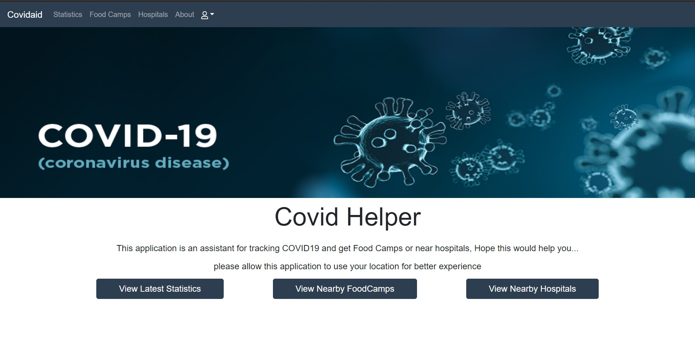
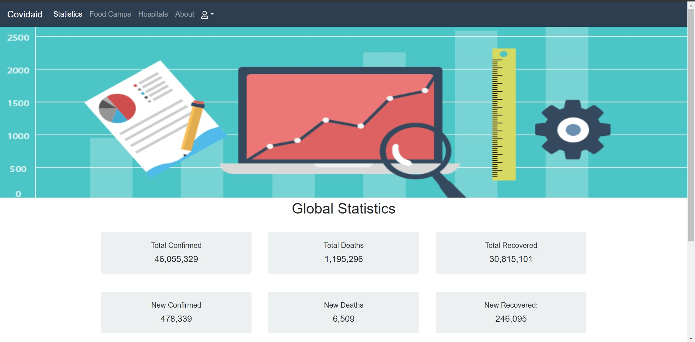
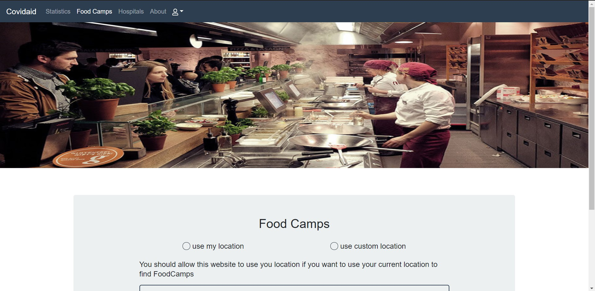
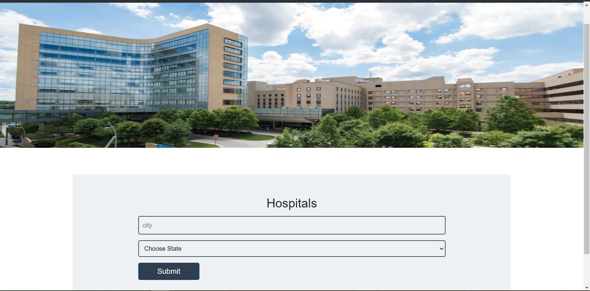

# Covid Helper

This application will provide three features to help the people who are stuggling with COVID19 to help them find hospitals or food camps near them and also track this virus and see the statistics of the global or they're country's status 

In the application user also has the ability to save the current statistic or chosen food camp or hospital to access this data later.

## Mock-Up

The following screen shots show the web application's appearance and functionality:

 

### Getting Started

In the root directory run these commands

`npm install`

`npm start`

see the options in package.json file for more

## Review

You cam watch the deployed application [here](https://whispering-refuge-98608.herokuapp.com/)
